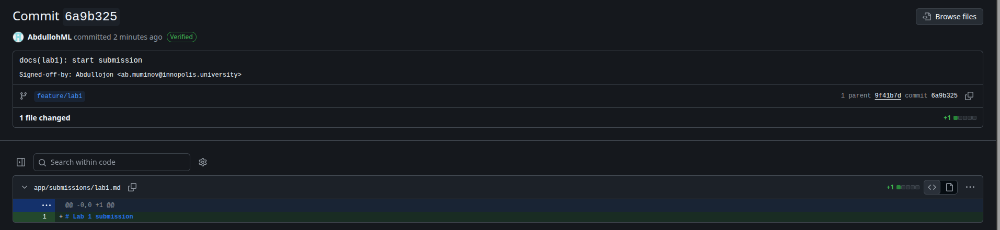

# Lab 1 — DevOps Foundations

## QuickNotes outputs

### GET /health

    {
        "notes": 4,
        "status": "ok"
    }

### GET /notes

    [
        {
            "id": 3,
            "title": "DevOps mantra",
            "body": "If it hurts, do it more often.",
            "created_at": "2026-01-15T10:10:00Z"
        },
        {
            "id": 4,
            "title": "Endpoint cheat-sheet",
            "body": "GET /notes  GET /notes/{id}  POST /notes  DELETE /notes/{id}  GET /health  GET /metrics",
            "created_at": "2026-01-15T10:15:00Z"
        },
        {
            "id": 1,
            "title": "Welcome to QuickNotes",
            "body": "This is the project you'll containerize, deploy, monitor, and harden across all 10 labs.",
            "created_at": "2026-01-15T10:00:00Z"
        },
        {
            "id": 2,
            "title": "Read app/main.go first",
            "body": "Start by understanding the entry point - env vars, signal handling, graceful shutdown.",
            "created_at": "2026-01-15T10:05:00Z"
        }
    ]

### POST /notes

    {
        "id": 5,
        "title": "hello",
        "body": "first POST",
        "created_at": "2026-09-10T21:25:15.158117254Z"
    }

## Signed commit proof

    commit 4450e41a36ece45a7ab6c3b107a28ef82cea7706 (HEAD -> feature/lab1)
    Good "git" signature for abdullloh with ED25519 key SHA256:+B8NZ7G5HtIxqBHp7P9ChWASKTlf/AG2kgY7JAZpVdM
    Author: Abdullojon <ab.muminov@innopolis.university>
    Date:   Fri Sep 11 00:46:20 2026 +0300

        docs(lab1): start submission

        Signed-off-by: Abdullojon <ab.muminov@innopolis.university>

## Verified badge

## Why signed commits matter

By default, anyone can put any name and email into `git config`, so commit history is unauthenticated — the author field proves nothing. Signed commits fix this by attaching a cryptographic claim that the commit was really made by the holder of a specific key, which reviewers can verify. The March 2024 xz-utils incident is the cautionary tale: an attacker operating under the account "JiaT75" spent roughly two years posing as a trusted maintainer and nearly backdoored every SSH daemon on Linux. Verified commit signatures would have made it much harder to forge that identity and would have exposed the anomalous commits long before the backdoor shipped.

## GitHub Community

I starred `inno-devops-labs/DevOps-Intro` and `simple-container-com/api` to bookmark projects I want to keep an eye on, and followed my professor (@Cre-eD), TAs (@Naghme98, @pierrepicaud), and three classmates (@witch2256, @IamdLite, @aniksel) to stay connected with the people I'll collaborate with during the course.

Starring repositories matters in open source because stars are a lightweight signal of interest and trust — they help maintainers gauge adoption, help newcomers discover projects worth using, and give contributors a way to support work they rely on. Following developers helps in team projects and professional growth because it turns GitHub into a live feed of what your peers and mentors are building, making it easier to learn from their work, notice opportunities to collaborate, and stay visible in the community.
