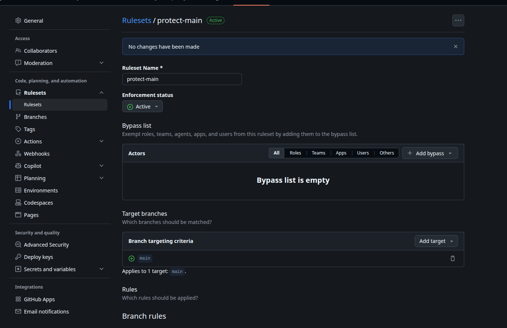

# Lab 3 — CI/CD: A PR-Gated Pipeline for QuickNotes

## Chosen path

**GitHub Actions**

## Task 1 — PR-gated CI

### 1.1 CI configuration

The CI workflow is located at:

`.github/workflows/ci.yml`

It is triggered by:

* pushes to `main`
* pull requests targeting `main`

The workflow contains three independent checks:

* `vet` — `go vet ./...`
* `test` — `go test -race -count=1 ./...`
* `lint` — `golangci-lint run`

The Go module is located in `app/`, so the workflow uses `app/` as the working directory.

The runtime environment is pinned to `ubuntu-24.04`, and Go is pinned to specific versions rather than using `latest`.

All third-party GitHub Actions are pinned to full commit SHAs.

The workflow also uses least-privilege permissions:

```yaml
permissions:
  contents: read
```

### 1.2 Working CI

Pull request:

https://github.com/AbdullohML/DevOps-Intro/pull/5

Green CI run:

https://github.com/AbdullohML/DevOps-Intro/actions/runs/34890308982

The final CI run completed successfully in 41 seconds.

The final pipeline contains:

* `ci / vet (1.23)`
* `ci / vet (1.24)`
* `ci / test (1.23)`
* `ci / test (1.24)`
* `ci / lint`
* `ci / ci-ok`

The `ci / ci-ok` check is required by the branch protection ruleset.

### 1.3 Deliberate CI failure

To prove that the PR gate detects broken code, I deliberately changed the expected HTTP status in `app/handlers_test.go`.

The correct assertion was:

```go
if rec.Code != http.StatusCreated {
```

I temporarily changed it to:

```go
if rec.Code != http.StatusOK {
```

The test then failed because the endpoint correctly returned HTTP 201.

Failed CI run:

https://github.com/AbdullohML/DevOps-Intro/actions/runs/34886236027

The relevant failure was:

```text
--- FAIL: TestCreateNote_RoundTrip
    handlers_test.go:64: expected 200, got 201: {"id":1,"title":"first","body":"hello","created_at":"2026-09-14T19:20:24.884244069Z"}
FAIL
FAIL quicknotes 0.016s
Error: Process completed with exit code 1
```

The incorrect assertion was then reverted and CI became green again.

### 1.4 Branch protection

The `main` branch is protected by the `protect-main` ruleset.

The ruleset requires:

* pull request before merging
* required status checks
* branches to be up to date before merging
* force pushes blocked

The required CI gate is:

`ci / ci-ok`

The branch protection configuration is shown in:

`rule.png`

A direct push to `main` was also tested. GitHub rejected it with:

```text
GH013: Repository rule violations found for refs/heads/main.

Changes must be made through a pull request.

3 of 3 required status checks are expected.
```

This confirms that direct pushes to `main` are blocked.

## Task 1 — Design questions

### a) Why pin `ubuntu-24.04` instead of using `ubuntu-latest`?

`ubuntu-latest` is a moving target. GitHub can change the Ubuntu version behind that label, which can change system packages, tools, libraries, or other parts of the CI environment.

Pinning `ubuntu-24.04` makes the environment predictable and reproducible. A future GitHub runner migration will not unexpectedly change the environment in which the project is tested.

### b) Why split vet, test and lint into independent jobs?

Independent jobs make failures easier to identify and allow the checks to run in parallel.

For example, if lint fails, it is immediately clear that the problem is related to linting. With one combined job, all checks would be in the same execution unit and a failure could prevent later checks from running.

Separate jobs also provide clearer status checks for the pull request.

### c) What real attack does SHA pinning prevent?

Pinning an action to a full commit SHA protects against a mutable tag or branch being changed to point to malicious code.

For example:

```yaml
uses: some/action@v1
```

depends on the current meaning of the `v1` tag.

A full commit SHA identifies one exact revision, so the workflow continues to execute the reviewed code even if a tag is later changed.

This is particularly important in light of the March 2025 `tj-actions/changed-files` compromise, where a compromised GitHub Action version could expose secrets from workflows using the affected action.

### d) What is `permissions:` and why use least privilege?

`permissions:` controls the permissions granted to the workflow's `GITHUB_TOKEN`.

This workflow only needs to read repository contents, so it uses:

```yaml
permissions:
  contents: read
```

This follows the principle of least privilege: a workflow should receive only the permissions necessary for its job.

If a workflow or one of its actions is compromised, limiting its permissions reduces the possible impact.

### e) GitLab: stage vs job; dependencies vs stages

A GitLab stage defines a broad phase of the pipeline. Jobs belonging to the same stage can run in parallel.

A job is an individual unit of work, such as running tests or linting.

Stages control the overall ordering of the pipeline, while dependencies can define which specific jobs a job depends on and which artifacts it receives.

# Task 2 — Faster and more selective CI

## 2.1 — Go module and build cache

Go caching was enabled using `actions/setup-go`:

```yaml
with:
  go-version: '1.24'
  cache: true
```

Caching is also enabled for the matrix jobs.

The cache is intended to reuse Go module and build cache data instead of repeating the same work on every run.

For this project, the speed improvement is limited because QuickNotes has essentially no third-party Go dependencies.

## 2.2 — Go version matrix

The `vet` and `test` jobs now run against both Go 1.23 and Go 1.24.

The matrix is configured as:

```yaml
strategy:
  fail-fast: false
  matrix:
    go: ['1.23', '1.24']
```

This produces separate checks for each Go version:

* `ci / vet (1.23)`
* `ci / vet (1.24)`
* `ci / test (1.23)`
* `ci / test (1.24)`

Lint remains a separate job using Go 1.24.

### Why `fail-fast: false`?

With `fail-fast: false`, a failure in one matrix job does not cancel the other matrix jobs.

This is useful for compatibility testing because it allows us to see whether a failure is specific to one Go version or affects all supported versions.

For example, if Go 1.23 fails but Go 1.24 passes, both results are still available.

`fail-fast: true` would be useful when the matrix is expensive and the remaining jobs provide little value after an early failure.

### Aggregation job

The matrix changes the names of the status checks, so the workflow also contains a stable `ci-ok` aggregation job.

It depends on:

```yaml
needs: [vet, test, lint]
```

and uses:

```yaml
if: always()
```

This ensures that the aggregation job is evaluated even when one of its dependencies fails.

It fails if any required job fails or is cancelled.

The branch protection ruleset requires:

`ci / ci-ok`

This prevents the matrix check names from breaking the branch protection configuration.

# Lab 3 submission

**Chosen path: GitHub Actions.** I used GitHub Actions because the repository is already hosted on GitHub, so the CI workflow, pull requests, status checks and branch protection can all be managed in one place.

The CI pipeline is defined in `.github/workflows/ci.yml`.

**PR:** https://github.com/AbdullohML/DevOps-Intro/pull/5

---

## Task 1: Write the PR Gate

### 1.1: CI pipeline

The pipeline runs on pushes to `main` and on pull requests targeting `main`.

The three required checks are independent jobs:

- `vet` runs `go vet ./...`
- `test` runs `go test -race -count=1 ./...`
- `lint` runs `golangci-lint run`

The Go jobs use Ubuntu 24.04 and the third-party GitHub Actions are pinned to full 40-character commit SHAs.

The `ci-ok` job aggregates the results of `vet`, `test` and `lint`, so branch protection can require one stable status check even though `vet` and `test` use a Go-version matrix.

**Green CI run:** https://github.com/AbdullohML/DevOps-Intro/actions/runs/34892015299

**Workflow:** https://github.com/AbdullohML/DevOps-Intro/blob/feature/lab3/.github/workflows/ci.yml

### 1.2: Design questions

#### a) Why pin `ubuntu-24.04` instead of `ubuntu-latest`?

`ubuntu-latest` is a moving alias. GitHub can change which Ubuntu release it points to, which can also change preinstalled tools, system libraries and other parts of the runner environment.

That means the same commit can potentially behave differently later without any change in the repository.

Using `ubuntu-24.04` makes the runner version an explicit part of the CI configuration. When I want to move to another runner version, I can do it deliberately in a reviewed commit.

#### b) Why split `vet`, `test` and `lint` into separate jobs?

There are three main reasons.

First, they can run in parallel, so the wall-clock time is closer to the slowest job instead of the sum of all three.

Second, failures are easier to diagnose. If everything is one job, the first failing command can hide failures in the other checks. Separate jobs show exactly whether `vet`, `test` or `lint` failed.

Third, each job produces its own status check, which makes the PR gate clearer and allows the final `ci-ok` job to aggregate their results.

#### c) What real attack does SHA pinning prevent?

A relevant example is the **tj-actions/changed-files compromise in March 2025**.

The incident demonstrated the risk of depending on mutable action tags. If a third-party action is referenced using a tag such as `@vX`, the tag can potentially be moved to another commit. If the upstream repository or release process is compromised, users can execute malicious code without changing their own workflow.

Pinning an action to its full 40-character commit SHA means the workflow refers to one exact commit. Moving a tag upstream does not change which code the workflow executes.

This does not make a compromised commit safe, but it prevents an upstream tag from silently changing the code executed by my workflow.

#### d) What is `permissions:` and what is the principle behind it?

`permissions:` controls what the automatically provided `GITHUB_TOKEN` can access during a workflow run.

The principle is **least privilege**: a workflow should receive only the permissions it actually needs.

My CI only needs to read the repository in order to check out the source code and run the Go tools, so the workflow starts with:

```yaml
permissions:
  contents: read
```

This reduces the possible impact if a dependency or third-party action used by the workflow is compromised.

#### e) GitLab: stage vs job, and what does `dependencies:` do that `stages:` doesn't?

A GitLab **job** is an individual unit of work that runs commands on a runner.

A **stage** groups jobs into an execution order. Jobs in the same stage can run in parallel, while later stages normally wait for the previous stage to finish.

`dependencies:` controls artifact downloading between jobs. It specifies which earlier jobs' artifacts should be downloaded into the current job.

Therefore, `stages:` controls the ordering of jobs, while `dependencies:` controls which artifacts are transferred between jobs.

---

## 1.5: Proving the gate blocks a bad change

I deliberately broke a test in `app/handlers_test.go`.

The original test expected:

```go
http.StatusCreated
```

I temporarily changed the expected status to `http.StatusOK`. The application correctly returned HTTP 201, so the test failed.

**Failed CI run:** https://github.com/AbdullohML/DevOps-Intro/actions/runs/34886236027

The relevant failure was:

```text
--- FAIL: TestCreateNote_RoundTrip
    handlers_test.go:64: expected 200, got 201: {"id":1,"title":"first","body":"hello","created_at":"2026-09-14T19:20:24.884244069Z"}
FAIL
FAIL quicknotes 0.016s
Error: Process completed with exit code 1
```

This demonstrated that a failing test causes the CI gate to fail.

I then restored the expected value to `http.StatusCreated` and pushed the fix.

**Green CI run after the fix:** https://github.com/AbdullohML/DevOps-Intro/actions/runs/34892015299

---

## 1.6: Branch protection

I configured branch protection for `main` in my fork.

The rules require changes to go through a pull request, require the branch to be up to date, require the CI status check to pass, and prevent force pushes.

The stable aggregation check is `ci / ci-ok`, so branch protection does not need to depend on individual matrix-generated check names.

**Branch protection screenshot:**



I also verified that a direct push to `main` was rejected by the repository rules:

```text
remote: error: GH013: Repository rule violations found for refs/heads/main.
remote:
remote: - Changes must be made through a pull request.
remote:
remote: - 3 of 3 required status checks are expected.
...
! [remote rejected] main -> main (push declined due to repository rule violations)
```

---

# Task 2: Make It Fast and Smart

## 2.1: Caching

I enabled Go caching through `actions/setup-go`:

```yaml
cache: true
```

This is intended to cache Go module downloads and the Go build cache.

However, QuickNotes has essentially no third-party dependencies. The project does not have a `go.sum` file, and the workflow log showed that the dependency-file lookup could not find a suitable dependency file at the repository root.

The cache warning was:

```text
Restore cache failed: Dependencies file is not found in
/home/runner/work/DevOps-Intro/DevOps-Intro.
```

Therefore I did not observe a meaningful cache speedup.

This is also consistent with the project having no substantial third-party dependencies to download, so there is very little dependency work for the cache to eliminate.

---

## 2.2: Build matrix

I changed `vet` and `test` to run against both Go 1.23 and Go 1.24.

The matrix uses:

```yaml
strategy:
  fail-fast: false
  matrix:
    go: ['1.23', '1.24']
```

The matrix jobs run in parallel, and one failed version does not cancel the other version.

This checks that the project works across both specified Go versions rather than only the version used locally.

The matrix also changes the individual check names, which is why I use the `ci-ok` aggregation job as the stable branch-protection check.

The aggregation job uses:

```yaml
if: always()
needs: [vet, test, lint]
```

and fails if any required job fails or is cancelled.

This allows the matrix to change without requiring the branch-protection rule to be updated every time.

---

## 2.3: Skipping docs-only changes

The workflow uses path filters so CI is triggered for changes to:

```text
app/**
.github/workflows/ci.yml
```

The relevant configuration is:

```yaml
on:
  push:
    branches: [main]
    paths:
      - 'app/**'
      - '.github/workflows/ci.yml'
  pull_request:
    branches: [main]
    paths:
      - 'app/**'
      - '.github/workflows/ci.yml'
```

I also tested adding a README-only change to the existing PR. CI still ran because the pull request already contained changes under `app/` and the workflow file.

This is because GitHub evaluates the paths for the **whole pull request**, not only for the latest commit. Therefore, adding a documentation-only commit to an existing code PR does not demonstrate the docs-only skip behavior.

A separate completely docs-only PR would be needed to demonstrate the skip behavior conclusively.

---

## 2.4: Measurements

I compared the workflow before and after the main Task 2 optimizations.

| Scenario | Observed runs | Wall-clock |
|---|---|---:|
| Baseline, single Go version | #6: 30s, #7: 30s, #9: 41s | median ≈ 30s |
| Cache enabled | #11: 60s | ≈ 60s |
| Cache + Go matrix | #12: 45s, #13: 46s, #14: 41s | median ≈ 45s |

**Baseline run #6:** https://github.com/AbdullohML/DevOps-Intro/actions/runs/34885376640

**Cache-enabled run #11:** https://github.com/AbdullohML/DevOps-Intro/actions/runs/34887571088

**Matrix run #14:** https://github.com/AbdullohML/DevOps-Intro/actions/runs/34890308982

These measurements should be interpreted cautiously because GitHub-hosted runner startup and other infrastructure overhead varies between runs.

The important observation is that caching did not make this project faster. The project has very little dependency work, so there is little dependency download time to remove.

The matrix increases the amount of work performed, but the matrix jobs run concurrently, so the increase in wall-clock time is much smaller than simply running every version sequentially.

---

## 2.5: Design questions

### f) Why cache `go.sum`-keyed inputs and not build outputs?

Dependency inputs are better cache keys because they represent the exact external dependencies used by the project.

A change in `go.sum` means the dependency set or dependency versions changed, so the cache can be invalidated.

Build outputs depend on many more inputs, including the Go version, operating system, architecture, build flags and source code. A poorly designed build-output cache can therefore return stale artifacts.

Caching dependency-related inputs is safer because the cache can be invalidated when the dependency definition changes instead of accidentally reusing an incompatible compiled output.

For this project, there is little practical benefit because QuickNotes has no substantial third-party dependency set.

### g) What does `fail-fast: false` change, and when do you want `fail-fast: true`?

With `fail-fast: false`, a failure in one matrix job does not cancel the other matrix jobs.

This is useful when the purpose of the matrix is to understand compatibility across multiple versions. If Go 1.23 fails but Go 1.24 passes, I still want the Go 1.24 result instead of having it cancelled.

`fail-fast: true` is more appropriate when matrix jobs are expensive and additional results are not useful after the first failure. In that case, cancelling the remaining jobs saves CI resources.

### h) What is the risk of an attacker writing a cache from a malicious PR that protected branches later read?

The main risk is **cache poisoning**.

A malicious pull request could potentially cause attacker-controlled data to be written into a cache. If a trusted workflow later restored that cache without sufficient isolation, the attacker-controlled files could be used during a build or execution step.

That could turn an apparently harmless cache restore into a way of executing untrusted content in a more privileged workflow.

Therefore cache scope and isolation are important. A protected branch should not blindly consume cache data produced by an untrusted pull request.
